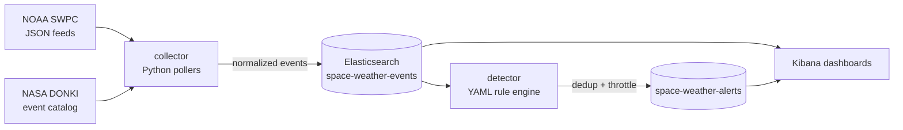

# Space-Weather SIEM

A complete SIEM (Security Information and Event Management) pipeline where the "threats" are **space-weather events** instead of security logs.

The bet: space weather is structurally identical to security telemetry — noisy real-time feeds from remote sensors, discrete events of varying severity, heterogeneous sources that need normalizing into one schema, detection rules that fire on threshold crossings, and alerting/dashboards on top. This project practices the full detection-engineering loop — **ingest → normalize → detect → alert → visualize** — on data that is free, public, schema-stable, and genuinely interesting.

## The analogy

| SIEM concept | Space-weather equivalent |
|---|---|
| Log sources / endpoints | NOAA SWPC real-time feeds (GOES, DSCOVR), NASA DONKI |
| Log collection / forwarders | Scheduled feed pollers (Python collector) |
| Normalization to a common schema (ECS) | One ECS-inspired event schema across all feeds |
| Severity taxonomy (low → critical) | NOAA G/R/S scales (G1–G5, R1–R5, S1–S5) |
| Threshold detection rules | Kp ≥ 5, X-ray flux ≥ M-class, proton flux ≥ 10 pfu |
| Multi-stage attack chain (kill chain) | Solar flare → CME → geomagnetic storm sequence |
| Alert dedup / throttling | Fingerprinted alerts, no re-alerting while active |
| "Log source down" detection | Telemetry-loss rule (feed silent for N × cadence) |
| Attack simulation / purple team | Replay of a historical G5 storm (May 2024 Gannon storm) |
| SOC dashboards | Kibana: alert triage, geomagnetic, solar activity, pipeline health |

And the "so what" of every alert is concrete: geomagnetic storms degrade GPS/GNSS accuracy and induce currents in power grids, radio blackouts knock out HF communications, radiation storms damage satellites and threaten polar-route aviation.

## Architecture



Four containers via `docker-compose`: **elasticsearch**, **kibana**, **collector**, **detector** — plus a one-shot bootstrap that applies index templates/ILM and imports dashboards.

## Data sources (all free)

- **NOAA SWPC** (`services.swpc.noaa.gov`, no API key): planetary K-index, solar wind plasma & magnetometer (DSCOVR), GOES X-ray flux, GOES proton flux, current NOAA scales, official alerts.
- **NASA DONKI** (`api.nasa.gov/DONKI`, free key): solar flares, CMEs, geomagnetic storms, SEP events — fuels the multi-stage correlation rule and historical replay.

## Detection rules

Rules live as YAML in [`rules/`](rules/) — detection-as-code, reviewed like any other code:

1. **Geomagnetic storm** — Kp ≥ 5, severity mapped to G1–G5
2. **Radio blackout** — GOES X-ray flux at M/X-class thresholds → R1–R5
3. **Radiation storm** — ≥10 MeV proton flux ≥ 10 pfu → S1–S5
4. **Storm precursor** — southward Bz ≤ −10 nT sustained + solar wind > 600 km/s (correlation)
5. **Event chain** — flare → CME within 6 h → Kp ≥ 5 within 1–3 days (multi-stage correlation)
6. **Telemetry loss** — a feed goes silent (the "log source down" classic)

## Quickstart

```sh
cp .env.example .env   # set passwords; add a NASA API key for higher DONKI limits
docker compose up -d   # ES + Kibana, one-shot bootstrap (templates/ILM), then the collector
```

That's the whole pipeline: `bootstrap` applies the index templates + ILM, `collector` polls all seven SWPC feeds and the four NASA DONKI catalogs on per-feed cadences (60 s / 5 min / 15 min) and indexes into `space-weather-events`, and `detector` evaluates the YAML rules in [`rules/`](rules/) every minute, writing deduped/throttled alerts to `space-weather-alerts`. The six rules span three threshold detections (Kp / X-ray / proton storms), two correlations (a Bz+speed storm precursor and the flare→CME→storm chain), and a feed-down "telemetry loss" health rule. Watch them with `docker compose logs -f collector detector`.

Kibana is at <http://localhost:5601> — log in as `elastic` with your `ELASTIC_PASSWORD`. The bootstrap step imports four ready-made dashboards (**SOC Overview**, **Geomagnetic**, **Solar Activity**, **Pipeline Health**) — open **Dashboards** in the menu, or jump straight to <http://localhost:5601/app/dashboards#/view/sws-dashboard-overview>. See [`kibana/`](kibana/) for what each one shows. On Linux hosts, Elasticsearch needs `sysctl -w vm.max_map_count=262144` first (Docker Desktop and OrbStack handle this for you).

To run the collector outside Docker (dev/tests), it reads `.env` automatically:

```sh
python -m venv .venv && .venv/bin/pip install -r collector/requirements.txt
.venv/bin/python -m collector --once   # one pass over every feed, then exit
```

## Backfill historical data

The collector polls short recent windows (6-hour / 1-day) to keep each poll light,
so a fresh stack has little history and the dashboards look sparse.
[`scripts/backfill.py`](scripts/backfill.py) fills them with **real** data — the
SWPC `*-7-day` product windows (a week of X-ray, proton, and solar-wind metrics)
plus a long DONKI look-back (months of real flares, CMEs, and storms):

```sh
.venv/bin/python scripts/backfill.py              # SWPC 7-day + DONKI 90 days
.venv/bin/python scripts/backfill.py --donki-days 30
```

It reuses the collector's normalizers and idempotent indexing, so re-running is
safe (overlapping records are skipped). Widen the Kibana time picker to see the
full DONKI catalog history.

## Replay the May 2024 G5 storm

Space weather is usually quiet, so the rules rarely fire on live data — the
dashboards' alert panels stay empty until they do. Rather than wait for the Sun,
replay a historical storm. [`scripts/replay.py`](scripts/replay.py) backfills the
**May 2024 Gannon storm** (committed fixtures in [`replay/`](replay/)) through the
real normalizers, with timestamps rebased to *now* so the detector sees a live G5:

```sh
.venv/bin/python scripts/replay.py        # inject the storm at the current time
.venv/bin/python -m detector --once        # evaluate — the storm rules fire
```

This is the purple-team / attack-simulation analog: a deterministic incident you
can summon for demos. The storm rules light up immediately — Geomagnetic Storm
(G5), Solar Storm Chain (flare→CME→storm), Radio Blackout (R3), Radiation Storm
(S1), and the Storm Precursor — and the alerts land deduplicated on the **SOC
Overview** dashboard. The sixth rule, telemetry-loss, is *absence* detection: it
fires when a feed is genuinely silent (the replay holds the plasma feed back to
demonstrate it — see its [runbook](docs/runbooks/telemetry_loss.md)). Replayed
events are tagged `replay`/`gannon-2024` so they're easy to filter out afterward.

Every alert has a triage playbook in [`docs/runbooks/`](docs/runbooks/) — impact
and response, one per rule.

> 🚧 The threshold and correlation rules rarely fire on live data — use the replay
> above to see the full pipeline light up on demand.

## Roadmap

- [x] **M0** — Repo bootstrap: README, license, CI stub
- [x] **M1** — Elasticsearch + Kibana via docker-compose, index templates + ILM
- [x] **M2** — First ingestion: Kp-index + X-ray feeds, normalizer + tests
- [x] **M3** — Full ingestion: all SWPC feeds + DONKI, idempotent indexing
- [x] **M4** — Detection engine: YAML rules, threshold rules 1–3, alert dedup/throttle
- [x] **M5** — Correlation + health rules 4–6: storm precursor, flare→CME→storm chain, telemetry loss
- [x] **M6** — Kibana dashboards (4 dashboards as code → NDJSON, imported by bootstrap)
- [x] **M7** — Historical-storm replay ([`scripts/replay.py`](scripts/replay.py)) + per-rule [runbooks](docs/runbooks/)

The full implementation plan is in [docs/PLAN.md](docs/PLAN.md).

## License

[MIT](LICENSE)
